# How to run the prototype
After you did both the setup of the QNN and for the attacker 'DeepGame' run the following:
```python
python launcher.py 'seed_number' 'first_image' 'last_image' 'dataset'
```
Where:

*seed_number*: set the seed for the execution. Note: if the seed does not match any of
the stored weights (previous training) the net is going to be trained from scratch.

*First Image*: index of the first image. On Cifar10, mnist max value is 9999.

*Last Image*: index of the last image. On Cifar10, mnist max value is 10000.

*dataset*: we support mnist, cifar10, fashion.

# How I want to run the analysis

~~I want to use *screen* to open 4 terminal windows on the server.~~

~~On each of them I want to run one of the following:~~

~~python launcher.py 10 0 2500 mnist~~
~~python launcher.py 10 2500 5000 mnist~~
~~python launcher.py 10 5000 7500 mnist~~
~~python launcher.py 10 7500 10000 mnist~~

~~Each of this command run the attacker on one image for all~~ 
~~the quantization levels (2,4,8,16,32,64) in parallel.~~

What I just crossed out, it is the hard way to do something easy.

```python
python launcher.py 10 0 10000 mnist
```

This is how we should run the analysis. What we need to tune is only the variable
'concurrentProcesses' described in the following.

'concurrentProcesses' describes how many pairs (ImageNumber, QuantizationLevel)
are being attacked at the same time. 

Ex. (img=10,Q=2) and (img=10,Q=4) are two different pairs!

If we figure out there is space for more parallelization (ex. CPU's usage is 60%),
we can easily modify in 'executor.py' the variable 'concurrentProcesses'.

# DeepGame (A Game-Based Approximate Verification of Deep Neural Networks with Provable Guarantees)

Min Wu, Matthew Wicker, Wenjie Ruan, Xiaowei Huang, Marta Kwiatkowska.

arXiv: 1807.03571
https://arxiv.org/abs/1807.03571

# Abstract
Despite the improved accuracy of deep neural networks, the discovery of adversarial examples has raised serious safety concerns. In this paper, we study two variants of pointwise robustness, the maximum safe radius problem, which for a given input sample computes the minimum distance to an adversarial example, and the feature robustness problem, which aims to quantify the robustness of individual features to adversarial perturbations. We demonstrate that, under the assumption of Lipschitz continuity, both problems can be approximated using finite optimisation by discretising the input space, and the approximation has provable guarantees, i.e., the error is bounded. We then show that the resulting optimisation problems can be reduced to the solution of two-player turn-based games, where the first player selects features and the second perturbs the image within the feature. While the second player aims to minimise the distance to an adversarial example, depending on the optimisation objective the first player can be cooperative or competitive. We employ an anytime approach to solve the games, in the sense of approximating the value of a game by monotonically improving its upper and lower bounds. The Monte Carlo tree search algorithm is applied to compute upper bounds for both games, and the Admissible A* and the Alpha-Beta Pruning algorithms are, respectively, used to compute lower bounds for the maximum safety radius and feature robustness games. When working on the upper bound of the maximum safe radius problem, our tool demonstrates competitive performance against existing adversarial example crafting algorithms. Furthermore, we show how our framework can be deployed to evaluate pointwise robustness of neural networks in safety-critical applications such as traffic sign recognition in self-driving cars.

# Problem Statement
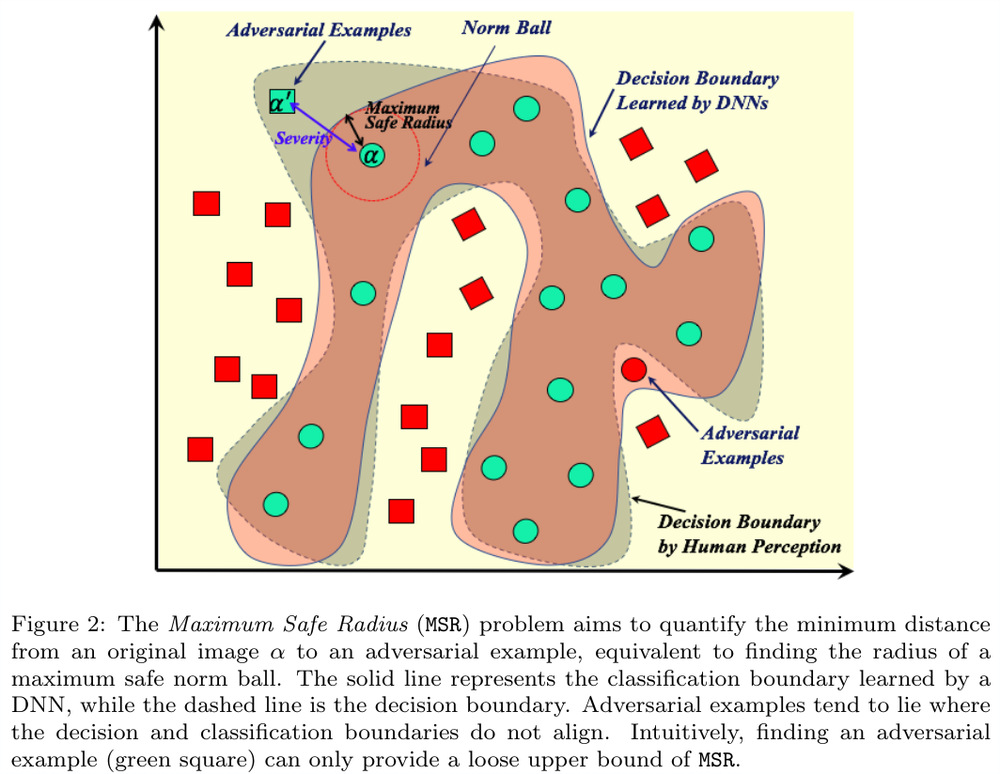
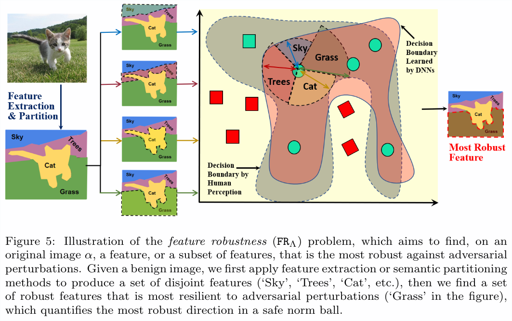

# Approach Architecture
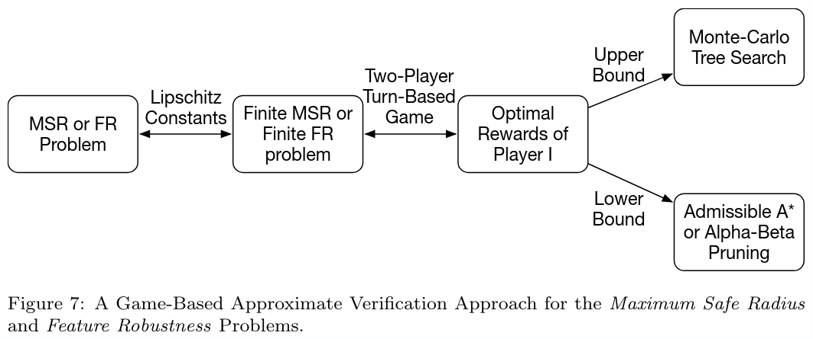
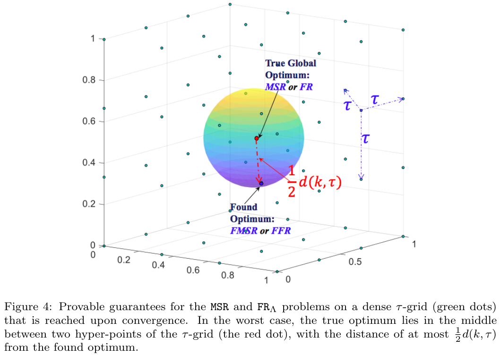
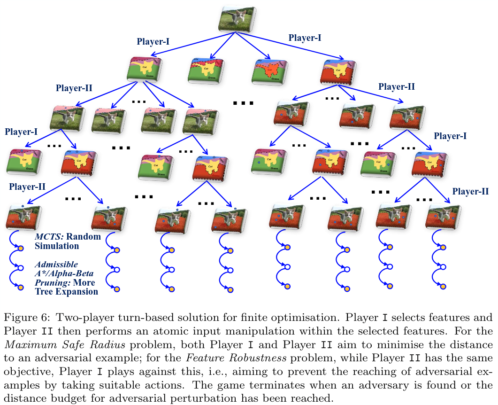

# Convergence Results
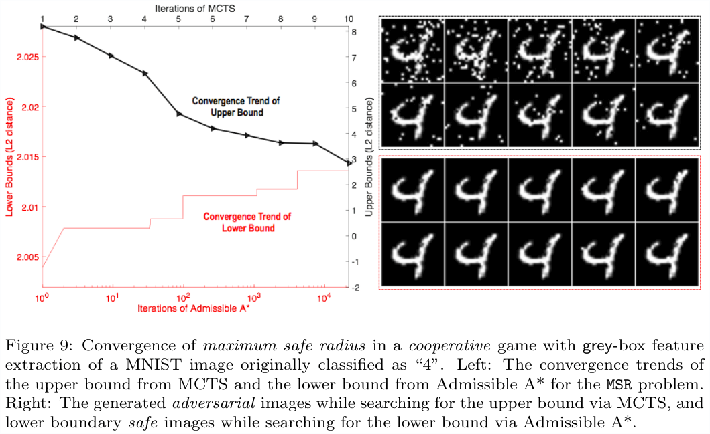
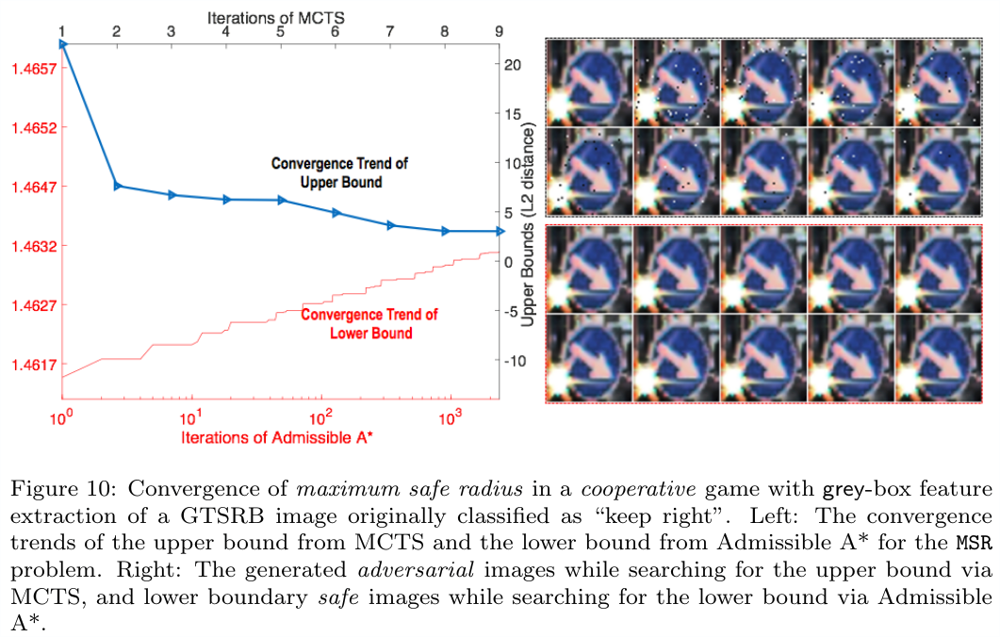
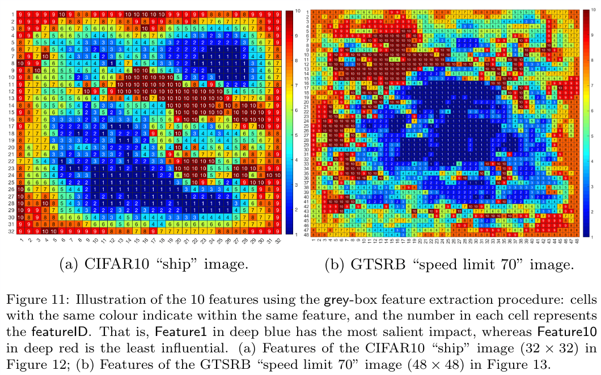
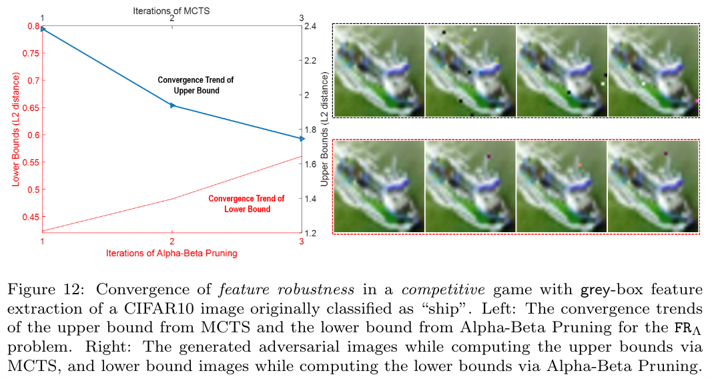
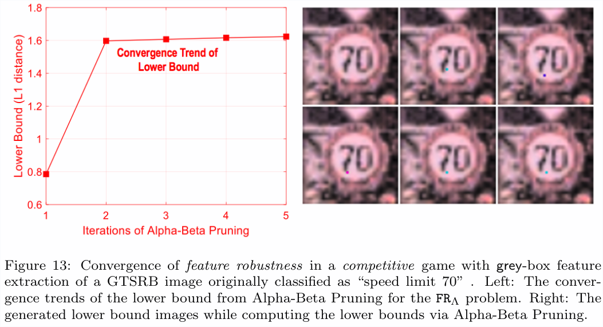

# Adversarial Examples
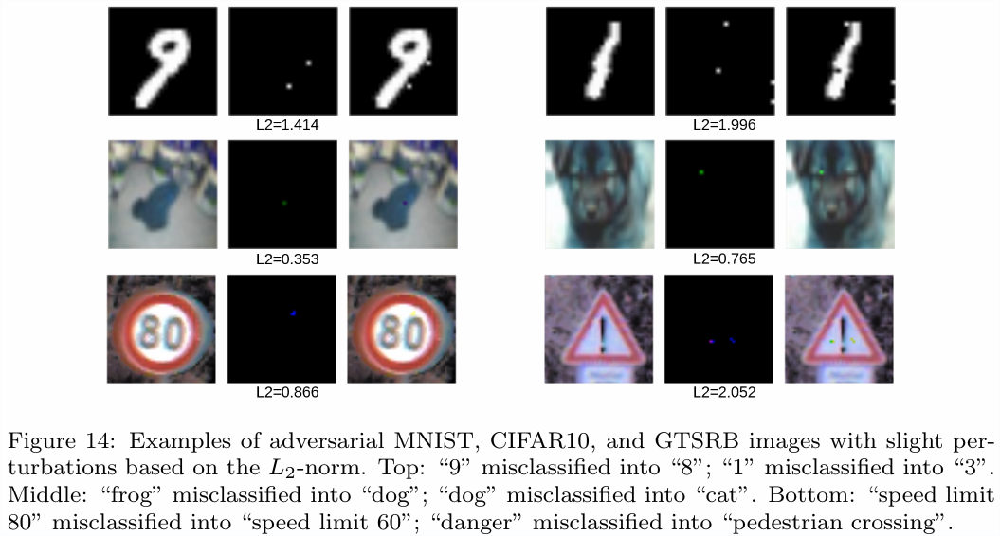
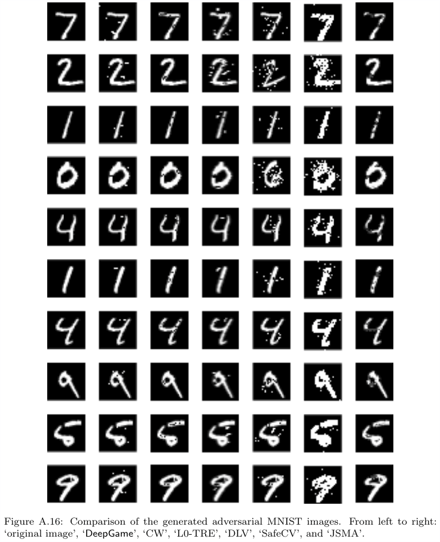
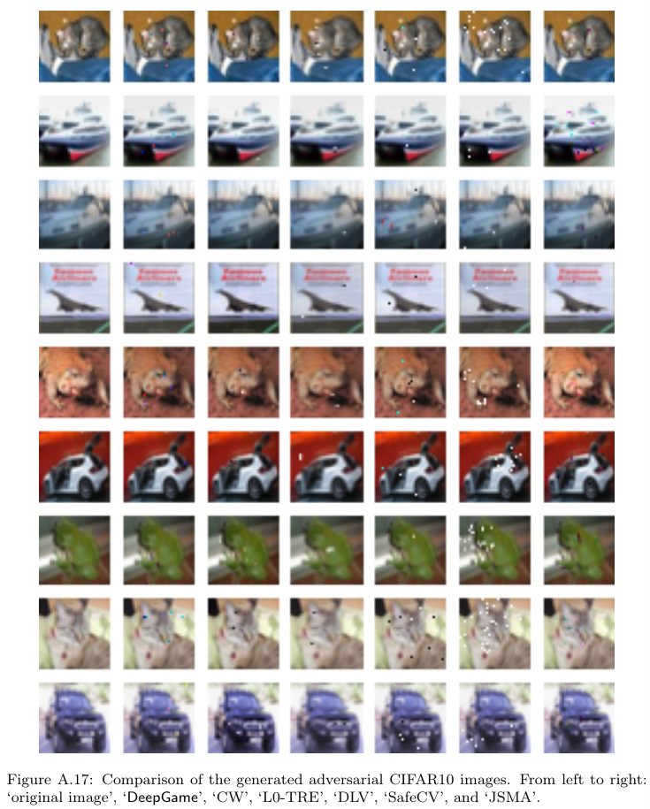
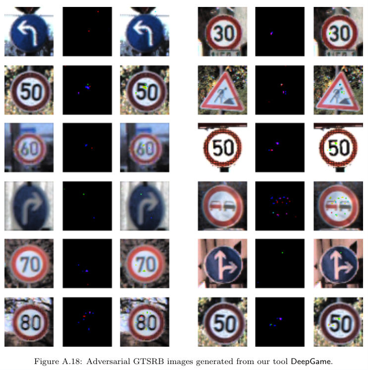


# Prerequisite
Installed pylearn2

# Install
```
python 3.6
pip3 install -r requirements.txt
```

# Test installation

```bash
python test_installation.py
```

If nothing crashes for a minute, it's all right, the installation is successful.

# Run
```
python3 launcher.py
```
